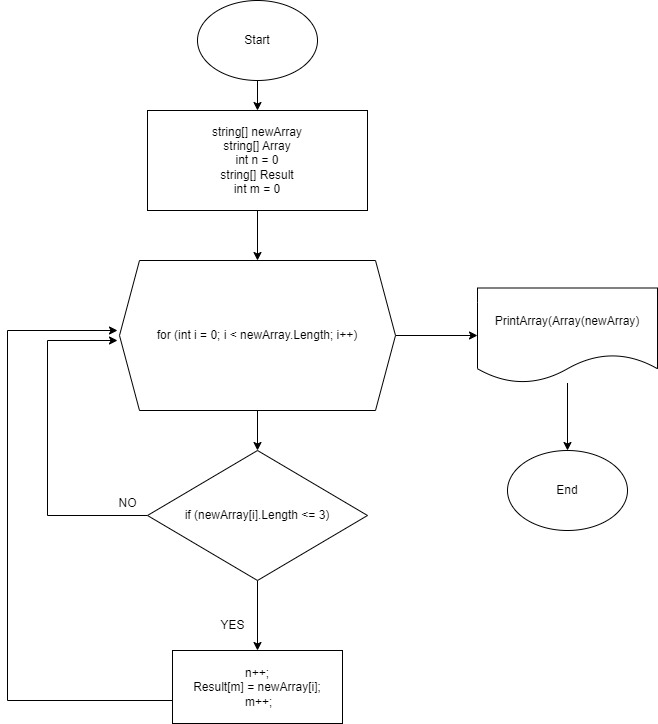

# Задача:
**Написать программу, которая из имеющегося массива строк формирует массив из строк, 
длина которых меньше либо равна 3 символа. Первоначальный массив можно ввести с клавиатуры , 
либо задать на старте выполнения алгоритма. При решении не рекоvендуется пользоваться коллекциями, 
лучше обойтись исключительно массивами.**

# Описание решения:
**Создан массив из 5 элементов. 
Функция ArrayInput предлагает пользователю ввести значения элементов массива (5).
Функция Array ищет среди элементов массива элементы, содержащие 3 и меньше символов, Result возвращает данные элементы.
Функция PrintArray печатает наш массив с уже отобранными элементами (3 и меньше символов).**

# Блок-схема

